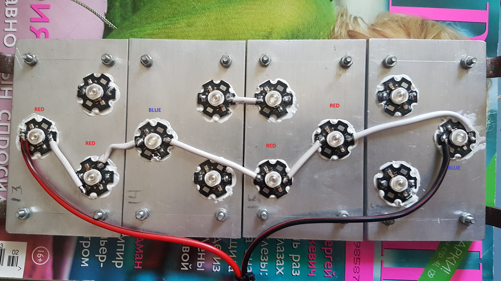

# Introduction
This repository implements partial smart green house system. The project itself cana be cosidered as a test platform for approaches and ideas for green housing, thus project is upgradable. The video below shows the completed project, click on it !

# Requirements
Lets start from software. The necessay programs you can download from natshool follow the path S6_ES2_Embedded Systems 2 --> software. In this project the "old" versions of software is used.

• **MPLABX-V3.61-WINDOWS-INSTALLER.EXE** 
• **XC32-V1.40-FULL-INSTALL-WINDOWS-INSTALLER.EXE**

Install and in case if software will ask for update, don't do it.

Now the list of requires hardware

• **chipKIT Pro MX4/MX7 (PIC 32 board)**, see [Digilent store](https://store.digilentinc.com/digilent-pro-mx7-pic32-based-embedded-systems-trainer-board/). 
• **Soil Humidity Hygrometer Moisture Detection Sensor**, [see here](https://www.ebay.com/itm/193579019780?hash=item2d12356e04:g:qrsAAOSwyo1fEV4a/). 
• **DC/DC buck converter**, 2 pieces, [see here](https://www.aliexpress.com/item/32880711859.html?spm=a2g0o.productlist.0.0.c2056dc1JRKjr1&algo_pvid=07528233-404a-41d1-bc98-66a08222c6cf&algo_exp_id=07528233-404a-41d1-bc98-66a08222c6cf-17). 
• **24V 5A PSU**, [see here](https://www.aliexpress.com/item/32917064576.html?spm=a2g0o.productlist.0.0.1e044929O7Oz3v&algo_pvid=c0f02355-a4ab-4b93-90f0-0c725b8d4208&algo_exp_id=c0f02355-a4ab-4b93-90f0-0c725b8d4208-16). 
• **5V 2A PSU**, [see here](https://www.aliexpress.com/item/1005002248248456.html?spm=a2g0o.productlist.0.0.47221c374vA218&algo_pvid=85bee760-1de0-4256-8bfb-cd93d364205c&algo_exp_id=85bee760-1de0-4256-8bfb-cd93d364205c-58). 
• **IRL540N**, 2 pieces [see here](https://www.aliexpress.com/item/33018674962.html?spm=a2g0o.productlist.0.0.4fcaf554dRe8s5&algo_pvid=e5f04b8b-bb7d-4e6c-b608-39f3f85b148d&algo_exp_id=e5f04b8b-bb7d-4e6c-b608-39f3f85b148d-0). 
• **4N35**, 2 pieces [see here](https://www.aliexpress.com/item/32832602337.html?spm=a2g0o.productlist.0.0.adb142caq9VaeE&algo_pvid=80694628-e859-43af-be53-580e0c18366b&algo_exp_id=80694628-e859-43af-be53-580e0c18366b-2). 
• **1N4001**, 2 pieces [see here](https://www.aliexpress.com/item/1005001552094086.html?spm=a2g0o.productlist.0.0.56f63da00oGqSh&algo_pvid=65960875-6243-4345-bc11-30e9f54c56d3&algo_exp_id=65960875-6243-4345-bc11-30e9f54c56d3-0). 
• **Pump**, [see here](https://www.aliexpress.com/item/1005002405644529.html?spm=a2g0o.productlist.0.0.64a82b8d0ngwYL&algo_pvid=7e207499-687f-481c-9cc4-6513fec3d382&algo_exp_id=7e207499-687f-481c-9cc4-6513fec3d382-0). 
• **Fan**, [see here](https://www.aliexpress.com/item/32815977265.html?spm=a2g0o.productlist.0.0.5fb66a0921BwNZ&algo_pvid=e2596c4d-6739-44ce-825a-b9f9dbc5cfa3&algo_exp_id=e2596c4d-6739-44ce-825a-b9f9dbc5cfa3-46). 
• **10 kOhm resistor** 
• **220 Ohm resistor** 
• **100 Ohm resistor** 
• **1.6 kOhm resistor** 
• **1 kOhm thermo-resistor** 
• **Deep Red 3W LED**, 4 pieces [see here](https://www.ebay.com/itm/331827730204?var=540913915522&hash=item4d4279571c:g:-acAAOSwy5ZXCge7). 
• **Royal Blue 3W LED**, 2 pieces [see here](https://www.ebay.com/itm/254943815529?var=554824610970&hash=item3b5bd5e769:g:meEAAOSwPVJgeQBr). 
• **Thermal glue**, [see here](https://www.aliexpress.com/item/1005001810626068.html?spm=a2g0o.productlist.0.0.c4e35b10uyqpxz&algo_pvid=ec34edbd-4966-46d3-9505-f41c84166e01&algo_exp_id=ec34edbd-4966-46d3-9505-f41c84166e01-0). 
• **Aluminium heatsinks**, 4 pieces [see here](https://www.ebay.com/itm/114879082071?hash=item1abf53ae57:g:VYAAAOSwOUxg4ox0). 
• **Silicone tube for pump, 20-30 cm, 6mm** 
• **Wires** 
• **Blue DC terminals** 
• **2 Metal strips, 26 cm, 1 cm, 3mm thick** 
• **Wires** 
• **Growbox**, [see here](https://royalroom.eu/en/classic-series/27-c30.html). 

# Building up

1. Create the project in MPLAB X and place the greenhouse.h and greenhouse.c files to project, clean and and upload to PIC 32.
2. Drill 4 heatsinks and attach them to two metal strips, then glue, using thermal glue the LED's the photo will ilustrate the LED placement. Use it as reference.

